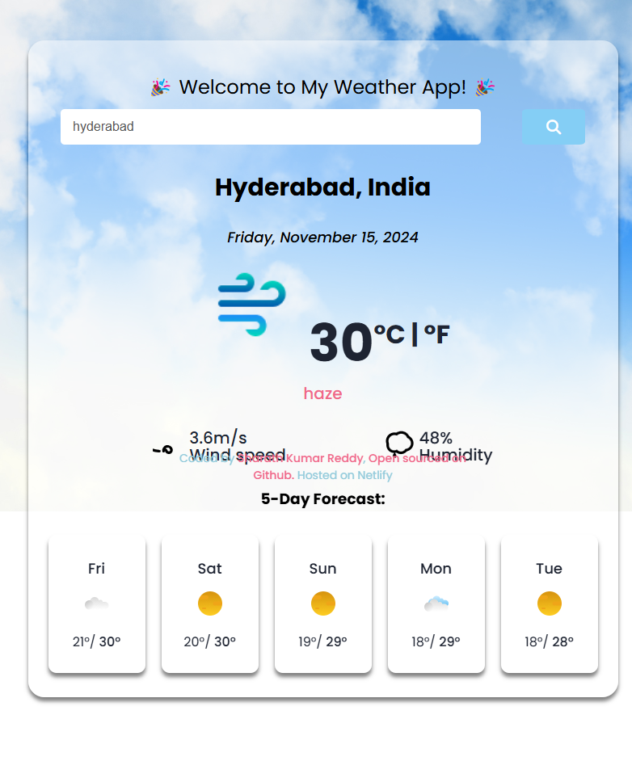

# ClearCast - React Weather App 🌦️

**ClearCast** is a web app developed as a project for the React workshop. Built using React.js, it enables users to search for the weather conditions of any city in the world and provides real-time weather information. The app fetches data using the Weather API.

---

## 🌟 Features
- **Global Search:** Find weather conditions for any city worldwide.
- **Real-Time Updates:** Displays current weather details, including temperature and descriptions.
- **API Integration:** Utilizes the Weather API for accurate data.

---

## 🛠️ Technologies & Tools Used
- **React.js** for building the UI
- **HTML**, **CSS**, and **JavaScript** for structure and styling
- **VS Code** as the code editor
- **Weather API** for real-time weather data

---

## 🚀 Installation and Usage
To run the app locally, follow these steps:

1. Clone this repository or download the source code.
2. Open the project in your preferred code editor.
3. Run `npm install` to install all necessary dependencies.
4. Start the development server with `npm start`.
5. Open your browser and navigate to `http://localhost:3000` to use the app.

**How to Use:**
- Enter the name of any city in the search bar.
- Press Enter to view the current weather conditions for the selected city.

---

## 🌍 Demo
Try out the live version of the app here: [ClearCast Live Demo](https://clearcast-by-sharath.netlify.app/).

---

## 👩‍💻 Credits
- **Developer:** [Sharath Kumar Reddy](https://github.com/sharath-66b6)
- **API:** Powered by the Weather API

---

## 📜 License
This project is licensed under the [MIT License](LICENSE).
